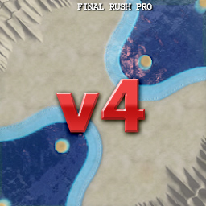

# Final Rush Pro 5

A survival map for [Supreme Commander: Forged Alliance Forever][FAF].

You can [read the documentation][docs].

## New in version 5

(Changes since v4.0007) This is a beta version, no stable release is available yet.

TL;DR: many new options, various balance enhancements, no more need for mods

**New lobby options**

* Added Survival Difficulty option (which can be used in both Survival Classic and Survival Versus)
* Added Auto Reclaim option (or rather made it work with recent versions of FAF)
* Added Spawn Delay option (survival modes only)
* Added options to specify T1, T2, T3 and T4 Spawn Frequency (survival modes only)
* Added options to specify T2, T3 and T4 Spawn Delay (survival modes only)
* Added option to specify the Health Increase of the spawned units (survival modes only)
* Added option to specify Random Event Frequency (survival modes only)
* Added option to specify Bounty Hunter Frequency (survival modes only)
* Added option to specify Bounty Hunter Delay (survival modes only)
* Added option that allows turning Aggression Tracking (punishing of fast tech, ACU in mid, etc) off (survival modes only)
* Fixed the MML restriction option (it did not show up in the lobby) (survival modes only)
* Fixed the T3 Mobile Arty restriction option (it did not show up in the lobby) (survival modes only)
* Fixed the Sniper Bot restriction option (it did not show up in the lobby) (survival modes only)
* Added option that allows turning all player air units on

Extra option values:

* Added additional possible values to the Auto Reclaim option
* Added additional possible values to the Player Tech Delay option

Other lobby improvements:

* Changed default values of the lobby options to what most people expect
* Improved the wording of all option titles and descriptions
* The Player Air restriction option now applies to all game modes
* Added description of the game modes to the map description visible in the lobby

**Survival modes**

* Random events now spawn units for both teams rather than one random victim
* Bounty Hunters now spawn for both teams rather than one random victim
* Random event units now only spawn for players that are still in game (rather than glitch and sit idly in the center) 
* Bounty Hunters will now attack targets in the bottom team (rather than glitch and sit idly in the center)
* All Bounty  Hunters now teleport out once their target has been killed (rather than a few glitching and remaining)
* Improved target areas selection of random event units
* Indestructible transports can no longer be captured or reclaimed

**Paragon Wars mode**

* Paragon Wars now works properly when playing with less than 8 players
* The Paragon Activator and civilian base now spawn in the exact center of the map (rather than deviating randomly)
* The civilian base is now symmetrical (rather than constructed randomly)
* Units will no longer automatically fire on the (indestructible) Paragon Activator
* The Paragon Activator now takes more build power to capture (multiple seconds instead of near instant)

**Internal changes**

* Dropped Final Rush UI and dependence on the FinalRushPro3 mod
* Refactored the codebase from procedural to object orientated
    * Cohesive sets of code now have their own modules
    * Global/static scope is now avoided where possible and dependency injection is used
* Moved the codebase into Git
* Added a limited number of automated tests
* Added README with installation instructions and release notes
* Set up continuous integration via TravisCI 

## Installation

* Download the [latest version of the map][download]
* Extract the zip and rename the directory from `FinalRushPro5-master` to `Final Rush Pro 5`
* Place the directory into `Documents\My Games\Gas Powered Games\Supreme Commander Forged Alliance\Maps`

Note: you do not need to have the FinalRushPro3 mod like you did with version 4 of this map.
Furthermore since the Auto Reclaim option has been fixed, you probably want to use that instead
of the Vampire mod.

## Updates and contributing

You can find the latest version of the map on the [Final Rush Pro 5 GitHub project][GitHub], which is
also the place where you can file issues, post feature request, and submit patches.

### Running the tests

Some of the code that does not bind to FA(F) directly is tested using the
[Busted unit testing framework][Busted]. To run the tests on Linux, execute `busted` in the project
root directory. To run them on Windows, well, I don't know how to work with Windows.

## Authors

The authors of the original map are Commander-Chronicles, TV-Nobby and Diegobah. Fixes where later
made by ozonex.

This version of the map includes files from the FinalRushPro3 mod, which was created by CommanderChronicles.

Changes in version 5.x are by [EntropyWins][Entropy]. The version 5 preview image was created by JuiceBoy.

[FAF]: http://www.faforever.com/
[docs]: http://wiki.faforever.com/index.php?title=Final_Rush_Pro_5
[download]: https://github.com/JeroenDeDauw/FinalRushPro5/archive/master.zip
[GitHub]: https://github.com/JeroenDeDauw/FinalRushPro5/
[Busted]: http://olivinelabs.com/busted/
[Entropy]: https://entropywins.wtf/
